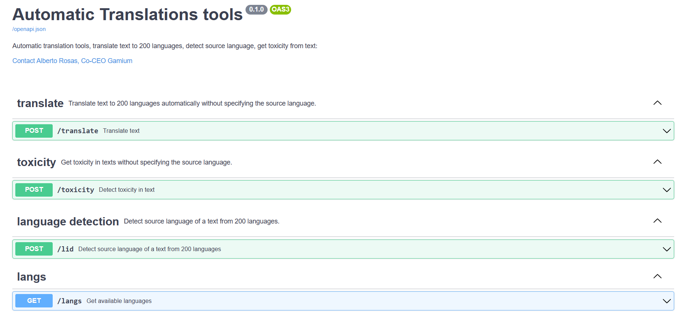

# Automatic Translation

This repository contains automatic translation tools for the Flores200 languages using the NLLB model from Meta AI (https://github.com/facebookresearch/fairseq/tree/nllb). 

This API allows you to translate text to 200 languages automatically, detect the source language of a text from 200 languages, and get toxicity in texts.

## Endpoints



### `/langs`

Get all the available translation languages.

**Method**: `GET`

#### Response

A list with all the available languages using FLORES-200 code.

### `/translate`

Automatic translation using NLLB model from Meta AI. Translate input_text in langs_out languages. Available languages: `[all languages listed in /langs endpoint]`.

**Method**: `POST`

#### Body

| Field       | Type   | Required | Description                                             |
|-------------|--------|----------|---------------------------------------------------------|
| input_text  | string | Yes      | The text to be translated.                              |
| langs_out   | string | No       | The languages to translate the input text to (comma separated). If not specified, it will translate to all languages. |

#### Response

The result of the translation service, containing translated text in all the languages specified.

### `/toxicity`

Get toxicity in texts without specifying the source language.

**Method**: `POST`

#### Body

| Field       | Type   | Required | Description                                             |
|-------------|--------|----------|---------------------------------------------------------|
| input_text  | string | Yes      | The text to be checked for toxicity.                    |

#### Response

The result of the toxicity detection service, containing toxic words in input_text.

### `/detect`

Detect source language of a text from 200 languages.

**Method**: `POST`

#### Body

| Field       | Type   | Required | Description                                             |
|-------------|--------|----------|---------------------------------------------------------|
| input_text  | string | Yes      | The text to detect the language of.                     |

#### Response

The result of the language detection service, containing the detected language of the input text.

## Usage

To learn how to use these tools, check out the `/examples` folder. There is also a frontend application built with Streamlit that consumes this API. To learn more, check out the following repository: https://github.com/rosasalberto/automatic_translation_frontend.

## Installation Docker

1. Get image
    ```console
    docker pull rosasalberto/translation-service
    ```
2. Run Image
    ```console 
    docker run --gpus all -p 8080:8080 translation-service
    ```

## Installation Guide

1. Install CUDA 11.6
   - Windows: https://docs.nvidia.com/cuda/cuda-installation-guide-microsoft-windows/index.html
   - Linux: https://docs.nvidia.com/cuda/cuda-installation-guide-linux/index.html
2. Install Microsoft C++ Build Tools if using Windows:
   - https://visualstudio.microsoft.com/visual-cpp-build-tools/
3. Install python 3.7.2 https://www.python.org/downloads/release/python-372/ and add to PATH:
    has to return Python 3.7.2
    ```console
    python --version
    ```
4. Upgrade pip
    ```console
    python -m pip install --upgrade pip
    ```
5. Install pipenv
    ```console
    pip install pipenv
    ```
6. Clone this repo
    ```console
    git clone https://github.com/rosasalberto/automatic_translation_server
    ```
7. Change directory and install the needed dependencies in a virtual environment and activate it
    ```console
    cd automatic_translation_server
    pipenv install --dev --python 3.7.2
    pipenv shell
    ```
| :warning: Please check the [troubleshooting section](#troubleshooting) if you get any problem installing or running the project |
|---------------------------------------------------------------------------------------------------------------------------------|
8. Download Language Detection (LID) model from the provided link: https://tinyurl.com/nllblid218e and add id to the '/weights' folder
9. Configure the server by modifying the `config.py` file:
   1. Modify `translation_langs` to include the languages you want to be able to translate, using the Flores200 language codes.
   2. Modify `lid_path` to the full path of the LID model.
   3. Modify `path_toxicity_data` to the full path to the toxicity vocab files.

## Run Server

#### Start server:
```console
uvicorn server:app --reload
```

#### API Swagger
http://127.0.0.1:8000/docs

#### Test streamlit frontend application
- Set up application from https://github.com/rosasalberto/automatic_translation_frontend

## Build your docker Image
To build a Docker image, you need to have Docker installed on your machine. If you don't have it already, you can install it by following the instructions on the Docker website: https://docs.docker.com/get-docker/

1. Get nvidia image for Cuda 11.6
    ```console
    docker pull nvidia/cuda:11.6.2-base-ubuntu20.04
    ```
2. Build docker Image 
    ```console
    docker build -t translation-service .
    ```
3. Run Image
    ```console 
    docker run --gpus all -p 8080:8080 translation-service
    ```
4. Optional: Upload your Image to the Docker Hub

## Troubleshooting

- In packages installation, if you experience problems related to the Python version, try the following command which
  forces **pipenv** to use a given version of Python:

    ```sh
    pipenv install --dev --python 3.7.2
    ```
- If you do not have python 3.7.2 on your system, you can:
1. Install Python using your operating system's package manager. On Linux systems, you can use apt-get or yum, and on macOS you can use brew.
2. Download the Python installer from the official Python website (https://www.python.org/) and run it to install Python on your system.
3. Use a version manager such as pyenv or asdf to install and manage multiple versions of Python on your system.

Once you have a Python interpreter installed, you should be able to use pipenv to install the dependencies for your project.

## Contact

If you experience any problem don't hesitate to contact: rosas.alberto.upc@gmail.com
